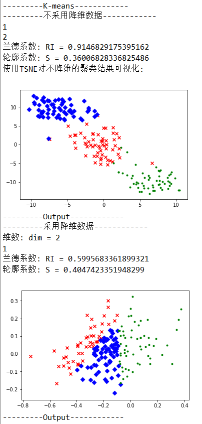

# report2

## 无监督聚类

### 代码运行

- 直接运行main.py即可
- 如果需要将聚类结果导出到output文件夹中，只需将main.py中的print("--------output---------")及以下部分取消注释即可

### 算法思想

#### 1. 数据预处理

- class DataSet()：为数据集建立的类

- 主要方法：preprocessing

  - 从sourcefile中读取源数据

  - 将训练数据和标签分离

  - min-max归一化处理：对每个维度的列向量，$colvec = \frac{colvec-min(colvec)}{max(colvec)-min(colvec)}$

    将数据集映射在[0,1]上，同时保持分布比例

#### 2. 降维算法 PCA

- 零均值化：每个列向量减去列均值使得各列的均值都为0
- 将trainset $[sample\_cnt\times old\_dim]$ 转置后求协方差矩阵 $[old\_dim\times old\_dim]$
- 对协方差矩阵求特征值和特征向量，并按特征值由大到小排序，利用threshold选择前k大的特征值对应的特征向量，构成转化矩阵 $[old\_dim\times k]$
- 将trainset与转化矩阵相乘，得到降维后的矩阵 $[sample\_cnt\times k]$，$k$ 为降维后所得的新维数

#### 3. 聚类算法 K-means

- 从样本中随机选择初始K个中心点
- 每次迭代时，遍历数据集，对每个样本计算其到K个中心点的距离（此处使用欧氏距离），找到距离最近的中心点，将其归为该簇
- 对每个簇，更新中心点的位置为簇的算术平均中心点
- 当所有中心点的更新偏移距离之和小于设置的epsilon值时停止迭代，否则继续迭代

#### 4. 评估函数

用测试集的label与predictlabel，分别计算兰德系数和平均轮廓系数

#### 5. 可视化

使用matplotlib提供的pyplot工具，对降至二维的数据点进行平面绘制，使用不同颜色区分各簇

#### 6. TSNE

另一种数据降维工具，用来和PCA对比降维后数据点的分布情况

### 性能测试和分析

  

#### 结果分析：

- **threshold对降维的影响**

  | threshold | dim  |  RI   |   S   |
  | :-------: | :--: | :---: | :---: |
  |    0.4    |  1   | 0.581 | 0.608 |
  |    0.5    |  2   | 0.514 | 0.364 |
  |    0.6    |  3   | 0.593 | 0.322 |
  |    0.7    |  4   | 0.607 | 0.304 |
  |    0.8    |  5   | 0.606 | 0.283 |
  |    0.9    |  8   | 0.616 | 0.223 |
  |   0.95    |  10  | 0.810 | 0.278 |

- **降维前后**：降维后导致兰德系数减小，且一般情况下维数越低兰德系数越小；降维后的轮廓系数在小范围内波动（dim=1时除外）

- 由于每次运行时初始K个中心点是随机选取的，故每次运行的聚类结果、性能指标值也不同。在多次运行中可以看到初始中心点的选取对聚类结果的影响还是比较大的，从轮廓系数的波动也可以看出每次聚类后各簇的形状分布也不尽相同。上述结论是在多次运行后得到的一般规律，仅具有参考价值，不一定适用每一次的聚类过程